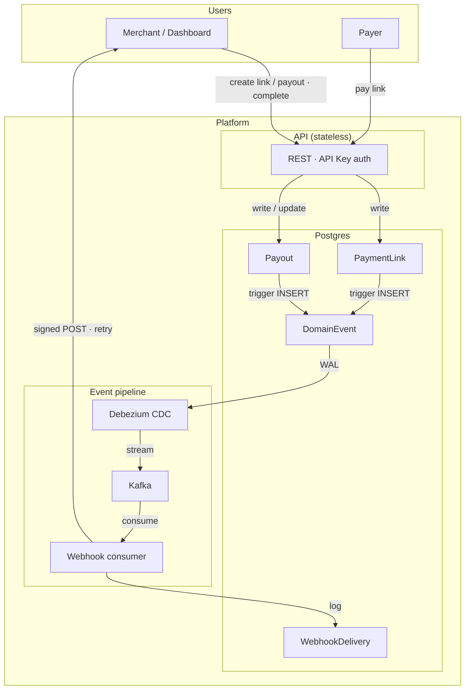
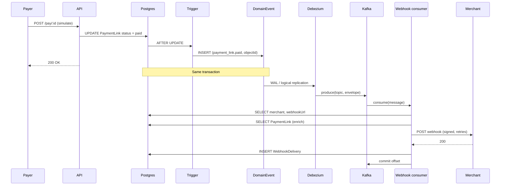

# Stablerail — A Fintech Webhook Architecture That Works 99% of the Time

A payment platform built around **one source of truth** (the database), **domain events** (DB triggers), and **durable event streaming** (Kafka + Debezium) so webhooks are reliable, auditable, and scalable.

---

## Why this architecture

- **Single source of truth:** All payment and payout state lives in Postgres. The API is the only writer.
- **Events in the same transaction:** Triggers insert into a `DomainEvent` table when status changes. No “state updated but event lost.”
- **Durable stream:** Debezium streams `DomainEvent` to Kafka. If the webhook consumer is down, events wait in Kafka and are replayed.
- **Async webhook delivery:** A dedicated consumer sends HTTP webhooks with retries and logging. The API never blocks on webhook delivery.
- **High delivery rate:** With retries, backoff, and Kafka at-least-once semantics, the pipeline achieves high reliability; the remaining failures are typically merchant endpoint issues (down, slow, or misconfigured).


## Design diagrams

### High-level architecture



### End-to-end sequence (payment link paid)



## Project structure

```
stablerail/
├── apps/
│   ├── api/                    # Express API (payment links, payouts, pay, webhooks)
│   │   └── src/
│   │       ├── app.ts          # App wiring, routes
│   │       ├── index.ts        # Entry, server listen
│   │       ├── lib/
│   │       │   └── webhook.ts  # Sign, send, retry, log webhooks
│   │       ├── middleware/
│   │       │   └── auth.ts     # API key auth
│   │       ├── routes/
│   │       │   ├── health.ts
│   │       │   ├── payment-links.ts
│   │       │   ├── payouts.ts
│   │       │   ├── pay.ts      # Public pay + checkout page
│   │       │   └── webhooks.ts # Settings, deliveries
│   │       └── workers/
│   │           └── webhook-consumer.ts   # Kafka consumer → webhook delivery
│   │
│   └── web/                    # Next.js dashboard
│       └── app/
│           ├── layout.tsx
│           ├── page.tsx        # Landing
│           └── dashboard/
│               ├── page.tsx    # Payment links + Payouts section
│               ├── payouts/
│               │   ├── page.tsx
│               │   └── create/page.tsx
│               └── webhooks/page.tsx
│
├── packages/
│   ├── database/               # Prisma + client
│   │   ├── prisma/
│   │   │   ├── schema.prisma   # Merchant, PaymentLink, Payout, etc.
│   │   │   └── seed.ts
│   │   ├── scripts/
│   │   │   └── setup-domain-event-trigger.ts   # Create Payout + PaymentLink triggers
│   │   └── src/
│   │       ├── client.ts
│   │       └── index.ts
│   │
│   ├── types/                  # Shared types (API, webhook events)
│   │   └── src/
│   │       ├── api.ts
│   │       ├── webhook.ts
│   │       ├── domain.ts
│   │       └── index.ts
│   │
│   ├── ui/                     # Shared UI components
│   ├── typescript-config/      # TS configs
│   └── eslint-config/         # ESLint configs
│
├── docker/
│   ├── docker-compose.yml     # Kafka + Debezium Connect
│   └── README.md              # Kafka/Debezium + Neon + consumer setup
│
├── scripts/
│   └── register-debezium-connector.ts   # Register Debezium connector (env: DATABASE_URL / NEON_DIRECT_URL)
│
├── connector-neon.json        # Debezium connector config (DomainEvent → Kafka)
├── package.json               # Root scripts, turbo
├── turbo.json
└── README.md                  # This file
```

---

## Key files

| Path | Purpose |
|------|--------|
| `apps/api/src/index.ts` | API entry; loads env, starts server. |
| `apps/api/src/app.ts` | Mounts health, payment-links, pay, payouts, webhooks routes. |
| `apps/api/src/routes/payouts.ts` | Create/list/get payouts; simulate complete/fail (writes only; no inline webhooks). |
| `apps/api/src/routes/pay.ts` | Public payment link details + simulate pay; checkout page at `/pay/:id`. |
| `apps/api/src/routes/payment-links.ts` | Create/list/get payment links (API key). |
| `apps/api/src/routes/webhooks.ts` | Webhook settings + delivery history (API key). |
| `apps/api/src/lib/webhook.ts` | `sendWebhook`, `sendWebhookAndWait`, signature, retries, WebhookDelivery logging. |
| `apps/api/src/workers/webhook-consumer.ts` | Consumes DomainEvent topic; enriches; sends webhooks; commits offset. |
| `packages/database/prisma/schema.prisma` | Merchant, PaymentLink, Payout (and DomainEvent/WebhookDelivery/Idempotency when using Postgres + triggers). |
| `packages/database/scripts/setup-domain-event-trigger.ts` | Ensures Payout and PaymentLink → DomainEvent triggers exist (Postgres). |
| `scripts/register-debezium-connector.ts` | Registers Debezium connector for DomainEvent (uses env for DB URL). |
| `docker/docker-compose.yml` | Kafka + Debezium Connect. |
| `docker/README.md` | How to run Kafka/Debezium, Neon publication/slot, connector, webhook consumer. |

---

## Quick start

1. **Install and DB**
   ```bash
   pnpm install
   pnpm db:generate
   pnpm db:push
   pnpm db:seed
   ```

2. **Run API and web**
   ```bash
   pnpm dev
   ```

3. **Webhook pipeline (optional, for production-style flow)**
   - Start Kafka + Connect: `docker compose -f docker/docker-compose.yml up -d`
   - In Neon: enable logical replication; create publication for `DomainEvent`; create replication slot `debezium`
   - Register connector: `pnpm exec tsx scripts/register-debezium-connector.ts` (set `NEON_DIRECT_URL` or `DATABASE_URL`)
   - Run consumer: `pnpm --filter api run webhook-consumer` (requires `webhook-consumer` script and Kafka env in `apps/api`)

See `docker/README.md` for full steps and env vars.

---

## Scripts (root)

| Command | Description |
|--------|-------------|
| `pnpm dev` | Run all apps (turbo). |
| `pnpm build` | Build all. |
| `pnpm db:generate` | Generate Prisma client. |
| `pnpm db:push` | Push schema to DB. |
| `pnpm db:studio` | Open Prisma Studio. |
| `pnpm db:seed` | Seed DB. |
| `pnpm lint` | Lint all. |
| `pnpm check-types` | Typecheck all. |

---

## Tech stack

- **Monorepo:** pnpm workspaces + Turbo.
- **API:** Express, API key auth, Prisma.
- **Web:** Next.js (dashboard).
- **DB:** Prisma (SQLite for local; Postgres/Neon for production + CDC).
- **Events:** Postgres triggers → DomainEvent table → Debezium → Kafka.
- **Webhooks:** Kafka consumer → HTTP POST with HMAC signature, retries, delivery log.

This is the fintech webhook architecture that aims to work 99% of the time by keeping state and events in one place, streaming durably to Kafka, and delivering webhooks asynchronously with retries and logging.
